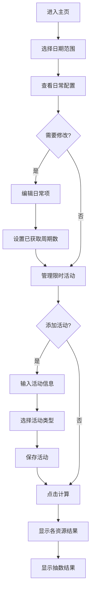

## 1. Product Overview
明日方舟抽数计算器是一款帮助玩家计算从指定日期到截止日期期间可获得抽数的工具。支持合成玉、至纯源石和寻访凭证三种资源的计算，并将其转换为抽数，最终得到最低、平均和最高三种预期值。

## 2. Core Features

### 2.1 User Roles
| Role | Registration Method | Core Permissions |
|------|---------------------|------------------|
| Normal User | None | Use calculator, manage custom events |

### 2.2 Feature Module
1. **计算器主页**: 日期选择、日常资源展示、计算结果输出
2. **日常配置**: 内置日常资源设定（合成玉/源石/凭证）、可编辑日常获取项
3. **活动管理**: 手动添加限时活动、活动类型区分（稳定/不确定）
4. **数据来源**: 支持联网查询PRTS Wiki和官网活动信息
5. **抽数转换**: 将所有资源自动转换为抽数（合成玉600=1抽，源石1=1抽，凭证1=1抽）
6. **周期获取标记**: 每周/每月资源可设置已获取的周期数，用于多周期日期范围
7. **特定日期检测**: 每月17号签到凭证自动根据查询日期判断是否可获取

### 2.3 Page Details
| Page Name | Module Name | Feature description |
|-----------|-------------|---------------------|
| 主页 | 日期选择器 | 选择开始日期和结束日期 |
| 主页 | 日常资源列表 | 显示每日/每周/每月稳定获取的合成玉、源石、凭证项目，支持设置已获取周期数 |
| 主页 | 限时活动列表 | 显示自定义添加的限时活动，支持增删改 |
| 主页 | 计算结果 | 展示三种资源的最低/平均/最高值，以及对应的抽数 |
| 主页 | 数据同步 | 按钮触发联网查询PRTS Wiki和官网活动 |
| 活动管理 | 添加活动 | 输入活动名称、日期范围、获取数量（三种资源分别设置） |
| 活动管理 | 活动分类 | 区分稳定活动和不确定活动类型 |

## 3. Core Process
用户进入主页 → 设置开始和结束日期 → 查看/编辑日常资源配置（设置已获取周期数） → 添加/管理限时活动 → 点击计算按钮 → 查看各资源数量和对应抽数结果



## 4. User Interface Design

### 4.1 Design Style
- Primary color: #1a1a2e (深色背景，符合游戏风格)
- Secondary color: #e94560 (红色强调，游戏主题色)
- Tertiary color: #0f3460 (深蓝辅助)
- Button style: 圆角矩形，悬浮效果
- Font: 使用游戏风格字体，搭配清晰的数字显示
- Layout: 卡片式布局，左侧日期和配置，右侧结果展示
- Animation: 结果展示时的数字滚动动画

### 4.2 Page Design Overview
| Page Name | Module Name | UI Elements |
|-----------|-------------|-------------|
| 主页 | Header | 游戏logo风格标题、副标题 |
| 主页 | DatePicker | 开始日期和结束日期选择器，日期差显示 |
| 主页 | DailyConfig | 日常项目列表，每项显示名称、资源类型、频率、数量、启用开关、已获取周期数输入 |
| 主页 | EventList | 活动卡片列表，显示名称、日期、三种资源数量、删除按钮 |
| 主页 | AddEvent | 添加活动弹窗，表单输入，三种资源分别设置最低/平均/最高 |
| 主页 | Result | 资源数量卡片 + 抽数卡片，显示最低/平均/最高值 |
| 主页 | SyncButton | 同步按钮，触发联网查询 |

### 4.3 Responsiveness
- Desktop-first 设计
- 移动端自适应：卡片堆叠显示，日期选择器优化

## 5. Data Requirements

### 5.1 资源转换规则
| 资源 | 转换为抽数比例 | 说明 |
|------|---------------|------|
| 合成玉 | 600 = 1抽 | 直接抽卡消耗 |
| 至纯源石 | 3.33 = 1抽 | 1源石=180合成玉，600÷180≈3.33 |
| 寻访凭证 | 1 = 1抽 | 直接抽卡消耗 |

### 5.2 日常资源来源（内置）

#### 合成玉
| 项目 | 频率 | 数量 | 说明 | 特殊处理 |
|------|------|------|------|----------|
| 每日任务 | 每日 | 100 | 完成全部日常任务 | - |
| 每周任务 | 每周 | 500 | 完成全部周常任务 | 可设置已获取周数 |
| 剿灭作战 | 每周 | 1800 | 每周剿灭奖励 | 可设置已获取周数 |
| 绿票商店 | 每月 | 600 | 绿票兑换 | 可设置已兑换月数 |

#### 至纯源石
| 项目 | 频率 | 数量 | 说明 | 特殊处理 |
|------|------|------|------|----------|

#### 寻访凭证
| 项目 | 频率 | 数量 | 说明 | 特殊处理 |
|------|------|------|------|----------|
| 每月签到 | 每月 | 1 | 每月17号签到 | 自动检测：查询日期≤17号则本月份可获取 |
| 绿票商店 | 每月 | 4 | 绿票兑换 | 可设置已兑换月数 |

### 5.3 限时活动类型
| 类型 | 说明 |
|------|------|
| 稳定活动 | 确定能获得的活动奖励（如活动任务、签到奖励） |
| 不确定活动 | 邮件补偿、维护奖励等，按最低/平均/最高估计 |

### 5.4 抽数计算示例
```
总合成玉 = 1800 → 3抽（1800 ÷ 600）
总源石 = 10 → 3抽（10 ÷ 3.33，1源石=180合成玉）
总凭证 = 5 → 5抽
总抽数 = 11抽
```

### 5.5 周期获取标记规则
- **每周资源**：设置已获取周数（如当前周已完成则设为1），计算时从总周数中减去已获取周数
- **每月资源**：设置已兑换月数（如当前月已兑换则设为1），计算时从总月数中减去已兑换月数
- **每月17号签到**：自动检测日期范围，只有当某月份的17号在日期范围内时才计入获取