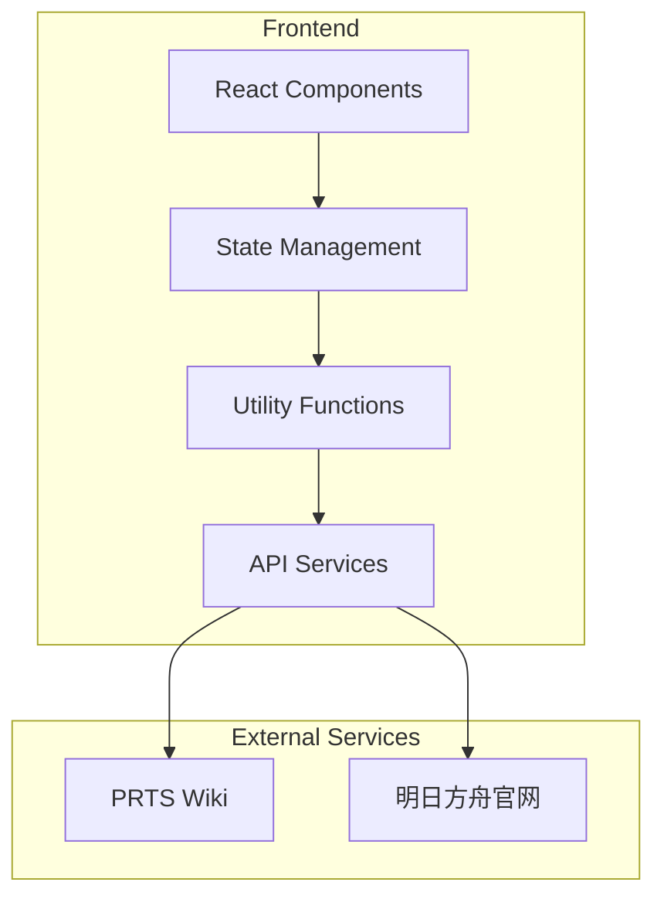

## 1. Architecture Design



## 2. Technology Description
- Frontend: React@18 + TypeScript + TailwindCSS@3 + Vite
- State Management: Zustand
- Icons: Lucide React
- HTTP Client: Fetch API
- Date Handling: date-fns

## 3. Route Definitions
| Route | Purpose |
|-------|---------|
| / | 主页，包含计算器核心功能 |

## 4. Data Model

### 4.1 ResourceType (资源类型)
```typescript
type ResourceType = 'syntheticJade' | 'pureOriginite' | 'recruitmentVoucher'
```

### 4.2 ResourceFrequency (获取频率)
```typescript
type ResourceFrequency = 'daily' | 'weekly' | 'monthly' | 'monthlyFixedDate'
```

### 4.3 DailyResource (日常资源)
| Field | Type | Description |
|-------|------|-------------|
| id | string | 唯一标识 |
| name | string | 资源名称 |
| resourceType | ResourceType | 资源类型 |
| frequency | ResourceFrequency | 获取频率 |
| amount | number | 获取数量 |
| enabled | boolean | 是否启用 |
| claimedPeriods | number | 已获取的周期数（0表示未获取，用于周/月资源） |
| fixedDate | number | 固定日期（仅monthlyFixedDate类型，如17） |

### 4.4 LimitedEvent (限时活动)
| Field | Type | Description |
|-------|------|-------------|
| id | string | 唯一标识 |
| name | string | 活动名称 |
| startDate | Date | 活动开始日期 |
| endDate | Date | 活动结束日期 |
| resources | EventResource[] | 各资源的数量范围 |
| type | 'stable' \| 'uncertain' | 活动类型 |

### 4.5 EventResource (活动资源)
| Field | Type | Description |
|-------|------|-------------|
| resourceType | ResourceType | 资源类型 |
| minAmount | number | 最低获取数量 |
| avgAmount | number | 平均获取数量 |
| maxAmount | number | 最高获取数量 |

### 4.6 ResourceTotals (资源总计)
| Field | Type | Description |
|-------|------|-------------|
| syntheticJade | number | 合成玉数量 |
| pureOriginite | number | 至纯源石数量 |
| recruitmentVoucher | number | 寻访凭证数量 |

### 4.7 CalculationResult (计算结果)
| Field | Type | Description |
|-------|------|-------------|
| minTotals | ResourceTotals | 最低各资源总数 |
| avgTotals | ResourceTotals | 平均各资源总数 |
| maxTotals | ResourceTotals | 最高各资源总数 |
| minPulls | number | 最低抽数 |
| avgPulls | number | 平均抽数 |
| maxPulls | number | 最高抽数 |

## 5. Component Structure

```
src/
├── components/
│   ├── DatePicker.tsx          # 日期选择器
│   ├── DailyResourceList.tsx   # 日常资源列表（含已获取周期数）
│   ├── EventList.tsx           # 活动列表
│   ├── AddEventModal.tsx       # 添加活动弹窗
│   ├── ResultCards.tsx         # 结果展示卡片
│   └── SyncButton.tsx          # 同步按钮
├── store/
│   └── calculatorStore.ts      # 状态管理
├── utils/
│   ├── calculate.ts            # 计算逻辑
│   └── api.ts                  # API调用
├── data/
│   └── defaultData.ts          # 默认数据
├── types/
│   └── index.ts                # 类型定义
├── App.tsx
└── main.tsx
```

## 6. Core Logic

### 6.1 日期计算
- 计算开始日期到结束日期的天数差
- 计算完整周数（用于每周资源计算）
- 计算完整月数（用于每月资源计算）
- 遍历日期范围内的每个月（用于每月固定日期资源）

### 6.2 资源转换规则
```typescript
const CONVERSION_RATES = {
  syntheticJade: 600,    // 600合成玉 = 1抽
  pureOriginite: 3.33,   // 3.33源石 = 1抽（1源石=180合成玉，600÷180≈3.33）
  recruitmentVoucher: 1, // 1凭证 = 1抽
}
```

### 6.3 日常资源计算

#### 6.3.1 每日资源
```
dailyTotals[resourceType] += amount × 天数
```

#### 6.3.2 每周资源
```
周数 = 完整周数
已获取周数 = claimedPeriods（用户设置）
实际周数 = max(0, 周数 - 已获取周数)
dailyTotals[resourceType] += amount × 实际周数
```

#### 6.3.3 每月资源
```
月数 = 完整月数
已兑换月数 = claimedPeriods（用户设置）
实际月数 = max(0, 月数 - 已兑换月数)
dailyTotals[resourceType] += amount × 实际月数
```

#### 6.3.4 每月固定日期资源（如17号签到）
```
遍历日期范围内的每个月：
  构造该月的固定日期（如17号）
  如果该日期在查询日期范围内：
    dailyTotals[resourceType] += amount
```

### 6.4 活动资源计算
- 筛选日期范围内的活动
- 稳定活动：使用avgAmount作为确定数量
- 不确定活动：分别计算最低/平均/最高值

### 6.5 抽数计算
```
pulls = Math.floor(syntheticJade ÷ 600) + pureOriginite + recruitmentVoucher
```

### 6.6 结果汇总
```
minTotals = dailyTotals + stableEventsAvgTotals + uncertainEventsMinTotals
avgTotals = dailyTotals + stableEventsAvgTotals + uncertainEventsAvgTotals
maxTotals = dailyTotals + stableEventsAvgTotals + uncertainEventsMaxTotals

minPulls = minTotals转换为抽数
avgPulls = avgTotals转换为抽数  
maxPulls = maxTotals转换为抽数
```

## 7. API Services

### 7.1 PRTS Wiki 查询
- 目标：获取活动奖励信息
- 方式：通过PRTS Wiki API或网页抓取
- 返回：活动名称、日期、奖励数量（合成玉、源石、凭证）

### 7.2 官网查询
- 目标：获取最新活动公告
- 方式：抓取官网活动页面
- 返回：活动名称、日期、奖励信息

## 8. Storage
- 使用 localStorage 持久化用户配置和活动数据
- 默认日常数据内置在代码中